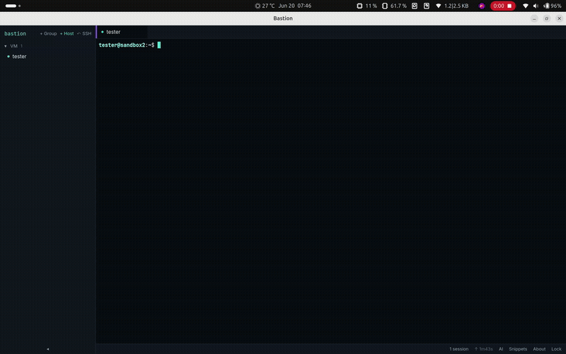
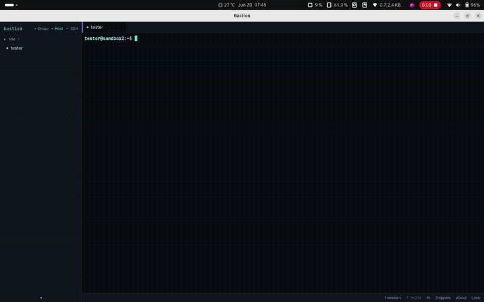
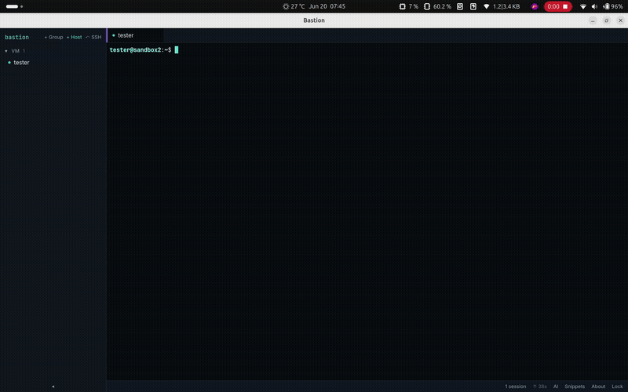

# Bastion

A local-first, cross-platform **SSH connection manager** with an encrypted
credential vault. Bastion keeps your hosts, passwords, keys, snippets, and
port-forward rules in a single SQLite database, encrypted under a master
password — and gives you a fast multi-tab terminal to connect with.

Built with [Wails v2](https://wails.io) (Go backend + React/TypeScript
frontend) and [xterm.js](https://xtermjs.org).

---

## Features

- **Encrypted vault** — secrets are sealed with AES-256-GCM under a key derived
  from your master password (Argon2id). The password is never stored; there is
  no recovery.
- **Host management** — organize SSH hosts into groups, with password or
  private-key authentication (encrypted passphrases supported).
- **Multi-tab terminal** — full PTY sessions over `golang.org/x/crypto/ssh`,
  rendered with xterm.js, with per-host font size and live session health.
- **Strict host-key trust** — unknown keys prompt once and pin to a
  `known_hosts` file; a *changed* key is a hard failure, never a silent accept.
- **Local port forwarding** — define `local → remote` rules per host that start
  and stop with the session, bound to `127.0.0.1` only.
- **File upload & download** — transfer files and folders to/from the remote
  host over SFTP via the right-click context menu on any connected terminal.
  Upload opens the native OS file/folder picker; download opens a remote file
  browser with directory navigation and multi-select. Directories are
  transferred recursively with their structure preserved. Both reuse the
  session's existing authenticated connection — no extra password prompt.
- **Snippets** — save and paste frequently used commands.
- **AI chatbot** — describe what you want and get a shell command,
  powered by OpenAI, Anthropic, or any OpenAI-compatible provider (OpenRouter,
  Ollama, etc.). The chat is stateful — the AI understands context across
  messages. Bring your own API key — stored encrypted in the vault.
- **AI error explanation** — when a command fails (stderr patterns like
  `command not found`, `Permission denied`, etc.), Bastion can explain the error
  and suggest a fix.
- **Per-host font size** — each session remembers its own font size, adjustable
  from the host list context menu.
- **Right-click context menu** — right-click any connected terminal to Copy,
  Paste, upload files and folders, or download files and folders via a
  remote file browser (no keyboard interception, so vim and other TUI apps
  work).
- **SSH config import** — scan and import hosts from `~/.ssh/config`.
- **Auto-lock** — the vault locks on idle timeout and OS screen lock, tearing
  down every live session.

## Demos
### Context menu


### Snippets drawer


### AI drawer


---

## Security model

| Concern | Approach |
|---|---|
| Key derivation | Argon2id (`time=3`, `memory=64 MiB`, `threads=4`); legacy PBKDF2-600k vaults still unlock |
| Secret encryption | AES-256-GCM, random nonce per blob |
| Password check | Verify-blob scheme — confirms the master password without decrypting any credential |
| Credential boundary | Plaintext secrets travel renderer→Go only; the UI receives `hasPassword`-style flags, never the secret |
| Master password | Minimum 8 characters, enforced at the backend (not just the UI) |
| In-memory key | Held only while unlocked; zeroed on lock, screensaver, and shutdown |
| Host keys | Strict `known_hosts`; changed keys rejected as a possible MITM |

See [Operational notes](#operational-notes) below for vault location, session
logging, and auto-lock specifics.

## Requirements

- **Go** ≥ 1.25
- **Node** ≥ 18
- **[Wails CLI](https://wails.io/docs/gettingstarted/installation)** v2.12+
- **Linux:** GTK3 + WebKit2GTK dev packages. On distros shipping only
  `webkit2gtk-4.1` (Ubuntu 24.04+, Fedora 38+), the build tag `webkit2_41` is
  required — the `Makefile` already passes it.

## Development

The `Makefile` wraps the common tasks (all with the `webkit2_41` tag):

```bash
make run      # hot-reloading dev app (React + Go rebuild on change)
make build    # production binary -> build/bin/
make deb      # build + package a Debian .deb
make clean    # remove build/bin
go test ./... # run the Go test suite
```

To run without the Makefile on a WebKit-4.1 system:

```bash
wails dev   -tags webkit2_41
wails build -tags webkit2_41
```

## Repository layout

```
main.go            — Wails bootstrap
app.go             — App struct: owns the store, in-memory vault key, auto-lock
auth.go            — Setup/Unlock/Lock, KDF parameter handling
hosts.go           — host CRUD IPC + credential encrypt/decrypt boundary
sessions.go        — OpenSession, host-key trust, terminal I/O IPC
crud.go            — groups & snippets IPC
portforwards.go    — port-forward config IPC
hosts_import.go    — ~/.ssh/config scan & import
transfer.go        — file upload & download IPC: PrepareUpload, UploadFiles, ListRemoteDir, DownloadFiles
ai.go              — AI IPC: Chat, NewChat, ClearChat, ExplainError, Get/SetAIConfig, TestAIConnection
emitter.go         — Wails event emitter + optional session logging
session_health.go  — live session info

internal/vault/    — Argon2id KDF, AES-256-GCM, verify-blob (crypto core)
internal/store/    — SQLite persistence (hosts, groups, snippets, port_forwards)
internal/ssh/      — known-hosts trust, PTY session, port-forward & SFTP upload managers
internal/ai/       — LLM client with LangChain-Go: stateless Chat/ExplainError + stateful chatbot sessions with ConversationBuffer memory

frontend/          — React + TypeScript + Vite + Tailwind + xterm.js
```

The three `internal/` packages are deliberately decoupled: `vault` and `store`
know nothing of each other (ciphertext is opaque to the store), and `internal/ssh`
is vault-agnostic — callers pass resolved credentials and receive output through
an `Emitter` interface, so it's fully testable without Wails or a live server.

## Operational notes

### Vault location

On Linux the vault lives at `~/.config/bastion/vault.db`. The directory is
created on first launch with mode `0700`.

### Auto-lock

The vault locks automatically after an idle timeout (default 5 minutes,
configurable via `SetAutoLockSeconds`, minimum 60s) and when the OS screensaver
activates. **Locking closes every live SSH session** and rejects further
terminal input — a locked vault never leaves a writable terminal open behind it.

### File transfer (upload & download)

Right-click a connected terminal to open the context menu with file transfer
options. (Drag-and-drop onto the terminal is intentionally not used: on
Linux/WebKit2GTK the webview opens a dropped file instead of yielding its path,
so file selection goes through the picker.)

All transfers run over **SFTP on the session's existing SSH connection** — no
re-authentication, no second password prompt, and file bytes are read/written by
the Go backend directly (they never pass through the renderer).

#### Upload

**Upload Files…** and **Upload Folder…** each open the native OS file/folder
picker and show a confirmation dialog listing every file, the target host, and
the destination directory before sending.

- **Destination** — files land in the shell's current working directory when it
  can be determined, otherwise the remote home directory. The CWD is tracked
  from the OSC 7 escape sequence that well-configured shells emit on each prompt;
  shells that don't emit it fall back to home. Either way, the confirmation
  dialog shows the resolved path as an **editable** field, so you always see and
  can correct where files will go before sending.
- **Directories** — folders are uploaded recursively. Their structure is
  preserved on the remote side: uploading `project/` with `src/main.go` and
  `README.md` lands as `destDir/project/src/main.go` and
  `destDir/project/README.md`.
- **File permissions** — the original Unix file mode is preserved (e.g.,
  executable scripts stay executable after upload).
- **Overwrite** — an existing remote file with the same name is overwritten,
  matching `scp`'s default behavior.

#### Download

**Download…** opens a remote file browser dialog that lets you navigate the
remote filesystem over SFTP, select files and directories, pick a local
destination folder, and download with live per-file progress bars.

- **File browser** — directories and files are listed with sizes and modification
  times. Click a directory to navigate into it; use the path bar or the "Go up"
  arrow to move around. The path input is editable for quick jumps.
- **Selection** — tick the checkboxes next to files and folders. Folders are
  downloaded recursively. The button shows the count of selected files and
  folders.
- **Local destination** — choose a local folder via the native OS folder picker
  or type the path directly.
- **Progress** — each file shows an individual progress bar updated every 64 KiB.
  Failed files are marked with their error message; successful transfers show a
  checkmark.
- **Structure preservation** — downloading a remote directory recreates its
  layout locally. For example, downloading `project/` with `src/main.go` lands
  as `<localDir>/project/src/main.go`.
- **File permissions** — the original Unix file mode is preserved.
- **Safety** — path traversal is prevented at the backend: filenames containing
  `..` are rejected, and the resolved local path is verified to stay within the
  chosen destination.

### AI configuration

AI is **Bring Your Own Key** — Bastion never ships with bundled API credentials.

Chat sessions are backed by **LangChain-Go** with `ConversationBuffer` memory,
so the AI maintains context across messages in a single conversation session.

Supported providers:
- **OpenAI** — uses `https://api.openai.com/v1` by default
- **Anthropic** — uses the Anthropic Messages API
- **OpenAI-compatible** — any service with an OpenAI-compatible `/chat/completions` endpoint (OpenRouter, Ollama, Groq, etc.)

Your API key is encrypted under the vault master key and stored in `vault_meta`,
alongside the provider and model selection. Only the AI drawer's frontend
components talk to the Go IPC — the key never reaches the renderer.

Models use the provider's native naming convention:
- OpenAI: `gpt-4o`, `gpt-4o-mini`, etc.
- Anthropic: `claude-sonnet-4-20250514`, `claude-haiku-3-5`, etc.
- OpenRouter: `provider/model` format, e.g. `openai/gpt-4o`, `nvidia/nemotron-3-ultra-550b-a55b:free`

### Session logging

Session logging is **off by default**. When enabled (via `SetSessionLogging`),
Bastion writes the full terminal stream of each session to
`~/.config/bastion/logs/<label>-<timestamp>.log` with mode `0600`.

These logs are **plaintext** and can capture anything shown on the terminal,
including passwords typed at `sudo`/`mysql` prompts and other secrets. They are
**not** encrypted under the vault key. Leave logging disabled unless you
specifically need it, and treat the log directory as sensitive.

## ⚠️ No password recovery

The master password is never stored, transmitted, or recoverable. If you forget
it, the vault is permanently inaccessible. This is by design.
